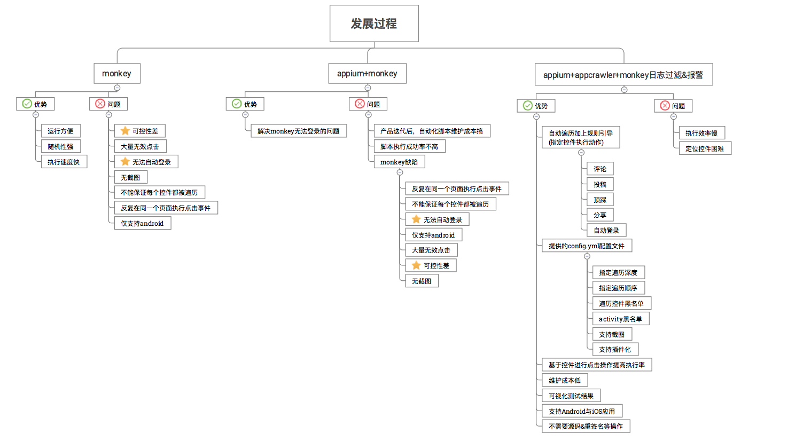

#
遍历自动化在测试中的应用

###背景
      在回归测试过程中，通常我们会利用Monkey来模拟用户触摸屏幕、滑动Trackball、按键等操作来对设备上的程序进行测试，检测程序多久的时间会发生异常。
    但是它也有许多弊端，比如：无效点击过多、不能保证测试到app内的每一个页面、不支持输入，对于需要登录的功能无法进行登录操作。且仅支持Android无法满足
    工作需求。

###遍历测试
      为了避免以上不足，我们使用AppCrawler对app进行遍历测试，AppCrawler是基于appium框架的一个自动遍历工具,可以在mac、windows及linux等桌面系统
    上运行，支持Android和iOS平台。使用遍历测试的好处主要在于一下几点：

       1.通过获取页面元素进行点击操作测试准确率高。
       2.自动爬取加上规则引导,解决monkey等工具可控性差的缺点。 比如可以设置遍历优先级、遍历时间、遍历层级等。
       3.可以针对不同的控件进行制定的操作，比如:在登录页面可以设置用户名&密码进行登录，直播页面设置发送留言、礼物等。
       4.回归测试.遍历基本的界面,了解主要界面的可用性. 比如兼容性, 基本功能。
       5.设置黑名单可以禁止遍历某些页面。
       6.支持插件化
       7.支持自动截获接口请求
       8.支持新老版本的界面对比
       9.Android和IOS平台

###发展史

###AppCrawler环境搭建及运行
需要的工具：Appium, Android SDK，xcode, Java,  appcrawler.jar
ps:运行依赖appium 安装发放详见：20160928_APPIUM环境搭建

    默认运行：
        命令行进入appcrawler.jar所在文件夹，
        输入java –jar appcrawler.jar –a joke.apk
    带配置文件：
        输入java –jar appcrawler.jar –c conf/test.yml –a osc.apk
    也可以在配置文件中指定测试apk，appium，超时时间，断言，需要访问的包等：
        输入java –jar appcrawler.jar –c conf/test.yml -p android
        或java –jar appcrawler.jar –c conf/test.yml -p iOS    Usage: appcrawler [options]

    -a, --app <value>        Android或者iOS的文件地址, 可以是网络地址, 赋值给appium的app选项
    -c, --conf <value>       配置文件地址
    -p, --platform <value>   平台类型android或者ios, 默认会根据app后缀名自动判断
    -t, --maxTime <value>    最大运行时间. 单位为秒. 超过此值会退出. 默认最长运行3个小时
    -u, --appium <value>     appium的url地址
    -o, --output <value>     遍历结果的保存目录. 里面会存放遍历生成的截图, 思维导图和日志
    --capability k1=v1,k2=v2...
                           appium capability选项, 这个参数会覆盖-c指定的配置模板参数, 用于在模板配置之上的参数微调
    -r, --report <value>     输出html和xml报告
    -vv, --verbose           是否展示更多debug信息

    ps:如果制定了配置文件同时又制定了 capability 属性则capability优先生效。

####结果展示：
         URL概念：每个app的界面都会抽象一个唯一的id标记, 这样可以类比为普通的接口测试中的url.点击等动作抽象为触发一个接口请求. 界面内每
    个控件的布局抽象为接口的返回。android 标记id(root节点) ：默认为activety。ios 没有activity概念所以需要手动指定，默认使用UIANavigationBar
    作为唯一标记～！ps：不适合所有应用所以推荐自定义。
    以内涵段子android为例运行后的结果如图所示：

####遍历控制config.yml
    1.capability应用配置：
       同appium定义一致，可以配置设备信息、端口号、app信息、启动时间、autowebview、超时配置等信息。
    2.pluginList 插件设置
      设置启用智能判断、log记录、代理插件（用于记录遍历时发送的请求）
    3.startupActions 启动操作用于开屏引导页
        startupActions:
        - swipe("left")
        - swipe("left")
        - swipe("down")
        - println(driver)
    4.triggerActions配置触发器
        #triggerActions表示遇到什么样的元素需要执行多少次的什么动作. 所以他有三个主要的配置.
            action: “click”  点击事件
                    “1111” 输入事件
                    swipe("left") 滑动事件
        xpath：空间识别方法
        times：1  #time:0表示永久生效
        例如：
            #triggerActions:
            #关注
            - action: "click"
            xpath: "//*[@resource-id='com.ss.android.essay.joke:id/main_follow']"
            times: 1
    5.blackList 设置url黑名单

    6.backButton 配置返回按钮
        适用于页面中无返回按钮且系统back键不生效场景。
        ps：由于appcrawler 设置tryback超次数时自动停止运行，所以特别适用于iOS，因为iOS无返回键。

        backButton:
        - "//*[@resource-id='com.ss.android.essay.joke:id/back']"
        # 登录协议页面点击同意

    7.自定义便利顺序
        firstList:
        - "//UIAPopover//*"
        selectedList:

        #android非空标签
        - //*[clickable="true"]
        lastList:
        - "//*[contains(@resource-id,'group_header_view')]//android.widget.TextView"

    注意：
        1.运行appcrawler默认会安装使用appium输入法，此输入法在点击输入框后不会弹出键盘。
        2.判断是否是异常退出可在log中搜索，Get the signal exit 查看退出提示。
        例如：backRetry 6 > backMaxRetry 5 need exit尝试返回次数大于最大返回次数停止爬取。
          maxTime out Quit need exit 运行超时。

####AppCrawler原码分析
    使用Scala编程语言（类似java，运行在JVM上）

    AppCrawler.scala是程序入口，负责：
        1.  解析命令行中的命令（代码直接写在里面了，感觉如果分一个类出来会更清晰）
        2.  解析配置文件（还是直接写在类里面，代码很多）
        3.  设定测试app和设定appium的端口
        4.  解析文件路径（如配置文件和app的路径），发现可以支持“http”, “ftp”, “https”, “file”，即可以测试非本地app

    AppiumClient.scala负责与appium交互：
        1.  监听appium进程的信息（执行成功，执行失败，停止等），从appium获得包名和activity
        2.  通过xpath找到组件，对重名的id只使用第一个。每隔5秒找一次，找10次后如果还找不到，则放弃
        3.  对组件的操作（如：滑动，点击，长按等）进行定义，动作是随机取的（类似monkey，方法名也叫monkey），位置信息用的是通过xpath找到的x，y坐标
        4.  对每次操作之后的界面截屏（如果界面改变的话）
        5.  获取页面结构（最多3次）解析xpath的时候拿到一个节点树，对树中所有节点遍历，具体实现在TreeNode.scala和Tree（应该是某库函数）

    控件点击：一次还是多次？
        1.  “定义url是遍历的关键. 这是一门艺术”——注释原文
        2.  URIElement.scala类负责组件的uri定义（如：joke/xxxActivity ）
        3.  根据注释：
            uri用来代表唯一的控件, 每个特定的命名控件只被点击一次. 所以这个element的构造决定了控件是否可被点击多次
            比如某个输入框被命名为url=joke id=input, 那么就只能被点击一次
            如果url修改为url=joke/xxxActivity id=input 就可以被点击多次

    URIElementStore.scala负责记录控件是否被点击
        1.  使用枚举类型， Clicked表示已遍历，Skiped = Value表示跳过
        2.  使用elementStore（Map类型）存储被点击的组件列表。联系URIElement.scala，如果组件url=joke，key只有1个，所以只能点一次。
            如果组件url=joke/xxxActivity，由于可能是不同Activity中的，所以可以点击多次。

####写在最后
       AppCrawler搭建到ci上配合打包任务可以做到每次提交代码后执行一次遍历测试，从而及时发现客户端crash。但是他也存在一些弊端比如：构建时间长、
    稳定性不高、环境搭建成本高等问题。