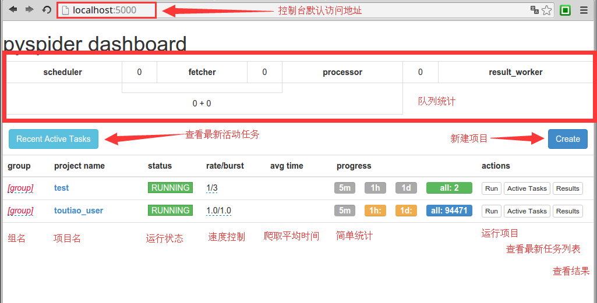
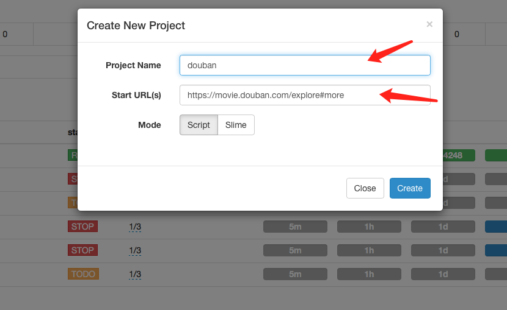
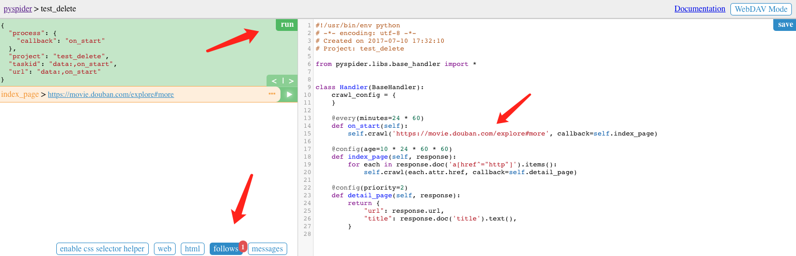
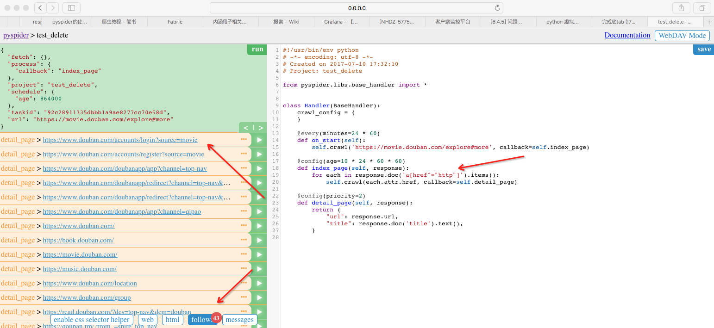
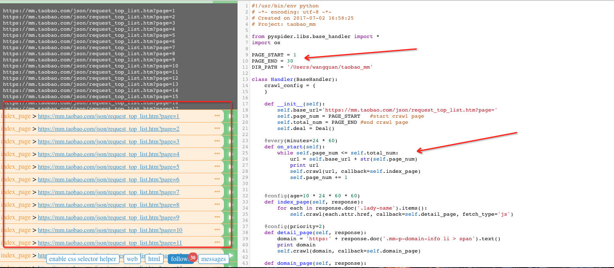
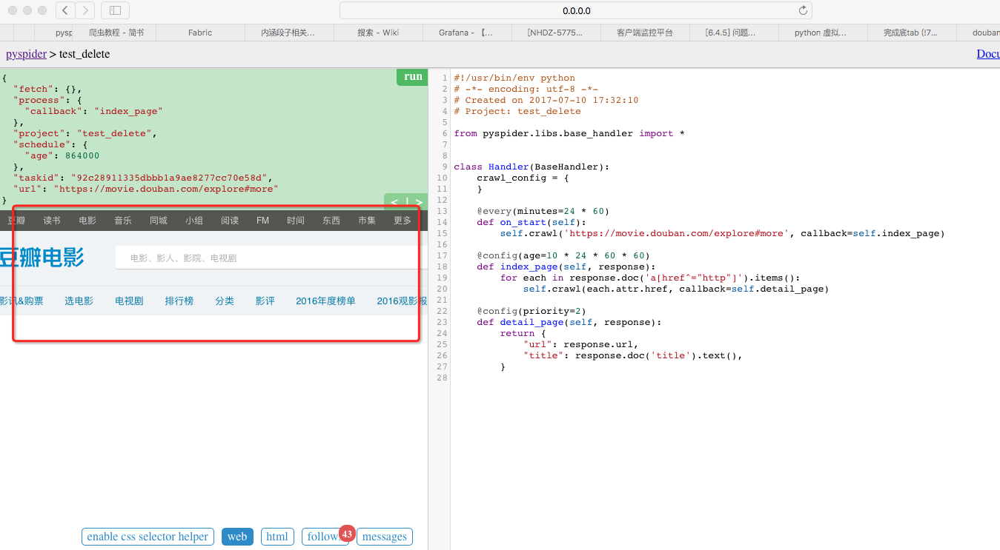
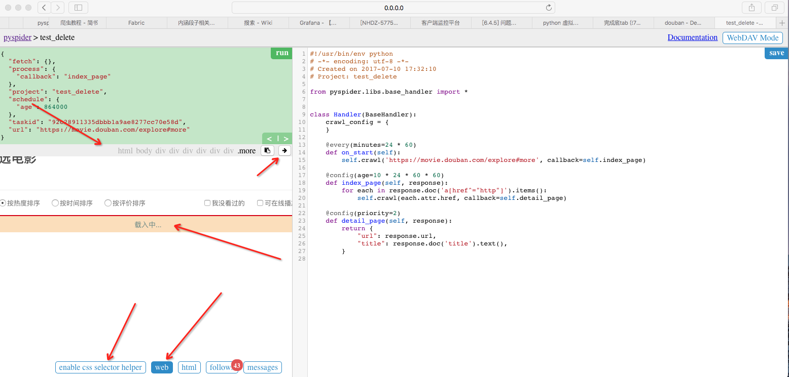
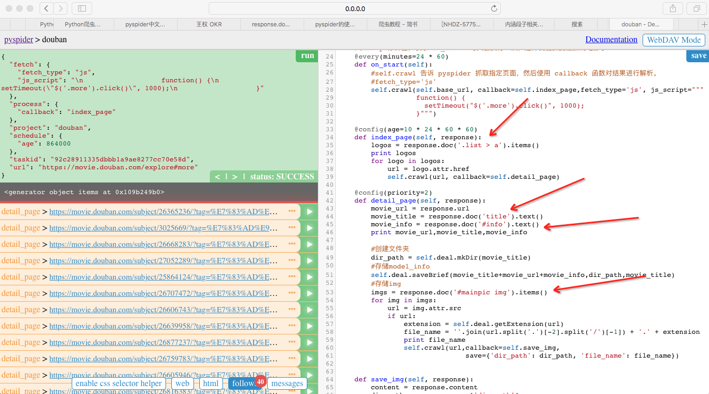
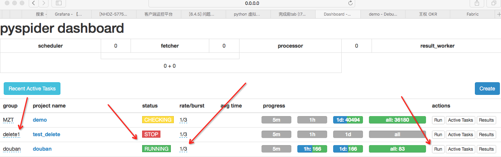

#Pyspider
1.安装pyspider

    sudo pip install pyspider
2.安装phantomjs

        PhantomJS 是一个基于 WebKit 的服务器端 JavaScript API。它全面支持web而不需浏览器支持，其快速、原生支持各种Web标准：
    DOM 处理、CSS 选择器、JSON、Canvas 和 SVG。 PhantomJS 可以用于页面自动化、网络监测、网页截屏以及无界面测试等。

    sudo brew install phantomjs

3. 启动pyspider

    终端下输入：pyspider all

4. 浏览器访问  http://localhost:5000

```
说明：
队列统计是为了方便查看爬虫状态，优化爬虫爬取速度新增的状态统计．每个组件之间的数字就是对应不同队列的排队数量．通常来是０或是个位数．如果达到了几十甚至一百说明下游组件出现了瓶颈或错误，需要分析处理．
新建项目：pyspider与scrapy最大的区别就在这，pyspider新建项目调试项目完全在web下进行，而scrapy是在命令行下开发并运行测试．
组名：项目新建后一般来说是不能修改项目名的，如果需要特殊标记可修改组名．直接在组名上点鼠标左键进行修改．注意：组名改为delete后如果状态为stop状态，24小时后项目会被系统删除．
运行状态：这一栏显示的是当前项目的运行状态．每个项目的运行状态都是单独设置的．直接在每个项目的运行状态上点鼠标左键进行修改．运行分为五个状态：TODO，STOP，CHECKING，DEBUG，RUNNING．各状态说明：TODO是新建项目后的默认状态，不会运行项目．STOP状态是停止状态，也不会运行．CHECHING是修改项目代码后自动变的状态．DEBUG是调试模式，遇到错误信息会停止继续运行，RUNNING是运行状态，遇到错误会自动尝试，如果还是错误会跳过错误的任务继续运行．
速度控制：很多朋友安装好用说爬的慢，多数情况是速度被限制了．这个功能就是速度设置项．rate是每秒爬取页面数，burst是并发数．如1/3是三个并发，每秒爬取一个页面．
简单统计：这个功能只是简单的做的运行状态统计，5m是五分钟内任务执行情况，1h是一小时内运行任务统计，1d是一天内运行统计，all是所有的任务统计．
运行：run按钮是项目初次运行需要点的按钮，这个功能会运行项目的on_start方法来生成入口任务．
任务列表：显示最新任务列表，方便查看状态，查看错误等
结果查看：查看项目爬取的结果．
```

5. 新建project
```
a.定义project name
b.定义start url
```

6. 运行
```
    点击create后pyspider会自动生成代代码，webUI左半部分是运行时输出的调试信息，右版部分是编写的代码。ps：更改代码后注意要先save后run。
点击run后pyspider会调用on_start方法并返回base_url。
```

```
    此时follows会有一个小红点，点击切换到follows页面点击index_page的开始按钮。on_start方法解析base_url并回掉callback参数中定义的index_page方法
index_page方法中使用正则表达式的方法解析response中的所有http链接并返回一个生成器对象 "response.doc('a[href^="http"]').items()"。
不过还是推荐使用css筛选器。
```

```
    ps:如果base_url进行了分页，那么可以指定start_page 和 end_page 抓去指定分页的数据
```

```
    此时点击切换到web页面，可以发现可以看到被抓取到页面
```

```
    a.细心到你可能会发现为啥没有电影cell直接显示了一个加载中呢？因为页面这里用到是JS渲染，普通的html抓取无法解决这个问题。此时可以使用PhantomJS和js_script
解决js渲染和渲染后的click操作。
    self.crawl(self.base_url, callback=self.index_page,fetch_type='js', js_script="""
                   function() {
                     setTimeout("$('.more').click()", 1000);
                   }""")
    b.css筛选器：点击enable css selector helper后web页面上方多出一行，此时鼠标点击加载更多后就能看到这个控件的css path了，点击右侧的尖头会自动生成到脚本中。
是不是很方便～！
```

```
    通过css筛选器，依次筛选出详情页的URL、电影名称、简介、封面并调用save函数将图片和信息存储下来。
```

```
    运行task 单步调试后保存退出到首页，将project改成debug or running 点击run就可以运行爬虫了
rate/burst：rate表示每间隔1秒抓取一个页面 burst 三个线程
```

```
    抓到到东东！
```

7. 运行时数据保存路径
 ```
 mac : /Library/Python/2.7/site-packages/pyspider
 ```
8. 删除project
```
在webui中组名改为delete后如果状态为stop状态，24小时后项目会被系统删除．
```
9. Script
```
#!/usr/bin/env python
# -*- encoding: utf-8 -*-
# Created on 2017-07-07 16:15:40
# Project: douban

from pyspider.libs.base_handler import *
import re,os

#PAGE_START = 1
#PAGE_END = 30
DIR_PATH = '/Users/wangquan/douban'


class Handler(BaseHandler):

    crawl_config = {
    }

    def __init__(self):
        self.base_url = 'https://movie.douban.com/explore#more'
        self.deal = Deal()

    #@every 修饰器，表示 on_start 每天会执行一次，这样就能抓到最新的电影了
    @every(minutes=24 * 60)
    def on_start(self):
        #self.crawl 告诉 pyspider 抓取指定页面，然后使用 callback 函数对结果进行解析。
        #fetch_type='js'
        self.crawl(self.base_url, callback=self.index_page,fetch_type='js', js_script="""
                   function() {
                     setTimeout("$('.more').click()", 1000);
                   }""")

    @config(age=10 * 24 * 60 * 60)
    def index_page(self, response):
        logos = response.doc('.list > a').items()
        print logos
        for logo in logos:
            url = logo.attr.href
            self.crawl(url, callback=self.detail_page)

    @config(priority=2)
    def detail_page(self, response):
        movie_url = response.url
        movie_title = response.doc('title').text()
        movie_info = response.doc('#info').text()
        print movie_url,movie_title,movie_info

        #创建文件夹
        dir_path = self.deal.mkDir(movie_title)
        #存储model_info
        self.deal.saveBrief(movie_title+movie_url+movie_info,dir_path,movie_title)
        #存储img
        imgs = response.doc('#mainpic img').items()
        for img in imgs:
            url = img.attr.src
            if url:
                extension = self.deal.getExtension(url)
                file_name = ''.join(url.split('.')[-2].split('/')[-1]) + '.' + extension
                print file_name
                self.crawl(url,callback=self.save_img,
                               save={'dir_path': dir_path, 'file_name': file_name})


    def save_img(self, response):
        content = response.content
        dir_path = response.save['dir_path']
        file_name = response.save['file_name']
        file_path = dir_path + '/' + file_name
        self.deal.saveImg(content, file_path)


class Deal:
    def __init__(self):
        self.path = DIR_PATH
        if not self.path.endswith('/'):
            self.path = self.path + '/'
        if not os.path.exists(self.path):
            os.makedirs(self.path)

    def mkDir(self, path):
        path = path.strip()
        dir_path = self.path + path
        exists = os.path.exists(dir_path)
        if not exists:
            os.makedirs(dir_path)
            return dir_path
        else:
            return dir_path

    def saveImg(self, content, path):
        f = open(path, 'wb')
        f.write(content)
        f.close()

    def saveBrief(self, content, dir_path, name):
        file_name = dir_path + "/" + name + ".txt"
        f = open(file_name, "w+")
        f.write(content.encode('utf-8'))

    def getExtension(self, url):
        extension = url.split('.')[-1]
        return extension

```


#n.commend line
```
Usage: pyspider [OPTIONS] COMMAND [ARGS]...

  A powerful spider system in python.

Options:
  -c, --config FILENAME    a json file with default values for subcommands.
                           {“webui”: {“port”:5001}}
  --logging-config TEXT    logging config file for built-in python logging
                           module  [default: pyspider/pyspider/logging.conf]
  --debug                  debug mode
  --queue-maxsize INTEGER  maxsize of queue
  --taskdb TEXT            database url for taskdb, default: sqlite
  --projectdb TEXT         database url for projectdb, default: sqlite
  --resultdb TEXT          database url for resultdb, default: sqlite
  --message-queue TEXT     connection url to message queue, default: builtin
                           multiprocessing.Queue
  --amqp-url TEXT          [deprecated] amqp url for rabbitmq. please use
                           --message-queue instead.
  --beanstalk TEXT         [deprecated] beanstalk config for beanstalk queue.
                           please use --message-queue instead.
  --phantomjs-proxy TEXT   phantomjs proxy ip:port
  --data-path TEXT         data dir path
  --version                Show the version and exit.
  --help                   Show this message and exit.
```

```
参考文档http://www.15um.com/330
```